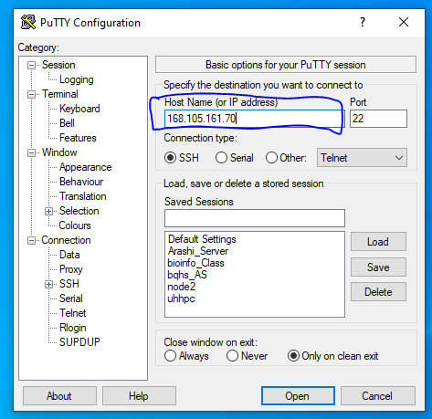
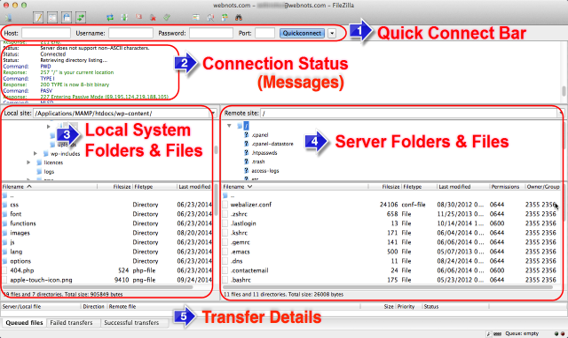

# Genome Assembly Pipeline

This repository provides a detailed step-by-step guide for genome assembly using **Rhodobacter sphaeroides** dataset as the primary example. It covers key processes such as data preprocessing, genome assembly, evaluation, visualization, comparison, and annotation. Additionally, it includes a guide for genome assembly using a downsampled **Zaire Ebolavirus** dataset for rapid analysis.

---

## Table of Contents

1. [Server Information](#1-server-information)  
2. [Dataset](#2-dataset)  
3. [Quality Visualization](#3-quality-visualization)  
4. [Quality Filtering and Trimming](#4-quality-filtering-and-trimming)  
5. [Genome Assembly](#5-genome-assembly)  
6. [Assembly Evaluation](#6-assembly-evaluation)  
7. [Assembly Visualization](#7-assembly-visualization)  
8. [Comparing Genomes](#8-comparing-genomes)  
9. [Genome Annotation](#9-genome-annotation)  
10. [Exercise](#10-exercise)
    - [Dataset](#exercise-dataset)  
    - [Quality Visualization](#exercise-quality-visualization)  
    - [Quality Filtering and Trimming](#exercise-quality-filtering-and-trimming)  
    - [Genome Assembly](#exercise-genome-assembly)  
    - [Assembly Evaluation](#exercise-assembly-evaluation)  
    - [Assembly Visualization](#exercise-assembly-visualization)  
    - [Comparing Genomes](#exercise-comparing-genome)  
    - [Genome Annotation](#exercise-genome-annotation)  
12. [Educational Notes](#11-educational-notes)
---

## 1. Server Information

### Prerequisites
- **Tools:** Install  [PuTTY](https://www.chiark.greenend.org.uk/~sgtatham/putty/latest.html), [FileZilla](https://filezilla-project.org/download.php), [Bandage](http://rrwick.github.io/Bandage/), [Mauve](https://darlinglab.org/mauve/mauve.html).  
- **Server Details:**  
  - **IP Address:** `168.105.161.70`  
  - **Port:** `22`  
  - **Access:** Requires JABSOM or UH network (use VPN for remote access).
  - Note: With PuTTY and FileZilla you can connect to server.
 
    
    

### Security Practices
- Avoid multiple failed login attempts to prevent account locking.  
- Use strong passwords or SSH keys.  
- Log out after completing tasks.

### Installing Miniconda
```bash
wget https://repo.continuum.io/miniconda/Miniconda3-latest-Linux-x86_64.sh
bash Miniconda3-latest-Linux-x86_64.sh
source ~/.bashrc
conda config --add channels defaults
conda config --add channels bioconda
conda config --add channels conda-forge
```
### Installing software
```bash
conda install mamba
mamba install sra-tools fastqc trimmomatic multiqc curl spades quast
```

---

## 2. Dataset

### Dataset Information
- **Organism:** Rhodobacter sphaeroides  
- **SRA ID:** [SRR522246](https://www.ncbi.nlm.nih.gov/sra/?term=SRR522246)  
- **Size:** Paired-end reads (~4.6 GB each, total 9.2 GB).
- **Time to download:** > 15 minutes

### Why This Dataset?
This dataset was chosen for its small genome size, high-quality sequencing data, and suitability for teaching genome assembly principles.

### Download Dataset
1. Create a directory for the assembly process:
    ```bash
    mkdir -p assembly/rhodobacter
    cd assembly/rhodobacter
    ```
2. Use `fastq-dump` to download paired-end reads:
    ```bash
    fastq-dump --split-files SRR522246
    ```


---

## 3. Quality Visualization

### Why Perform Quality Control?
- Identify low-quality bases, adapter contamination, and sequencing artifacts.
- Ensure reliable downstream analysis.

### Steps
1. Create a directory for quality control results:
    ```bash
    mkdir -p qc
    ```
2. Run FastQC to assess the quality of raw reads:
    ```bash
    fastqc *.fastq -o qc/
    ```
3. Aggregate and summarize results using MultiQC:
    ```bash
    multiqc qc/
    ```
- Transfer qc and multiqc results to your local machine and view HTML reports.
  
### Key Metrics to Examine
- **Per-base sequence quality**: Should be high across all cycles.  
- **GC content**: Compare with the expected range for the organism.  
- **Overrepresented sequences**: Indicates adapter contamination.

---

## 4. Quality Filtering and Trimming

### Why Trim Reads?
- Improves downstream processes by removing low-quality regions and adapter sequences.

### Steps
1. Download adapter sequences:
    ```bash
    curl -OL https://raw.githubusercontent.com/BioInfoTools/BBMap/master/resources/adapters.fa
    ```
2. Trim reads using Trimmomatic:
    ```bash
    trimmomatic PE SRR522246_1.fastq SRR522246_2.fastq \
      trimmed_1.fastq unpaired_1.fastq \
      trimmed_2.fastq unpaired_2.fastq \
      ILLUMINACLIP:adapters.fa:2:30:10 \
      LEADING:20 TRAILING:20 AVGQUAL:20 MINLEN:20
    ```

### Explanation of Parameters
- **PE** - Specifies that the input data consists of **paired-end** reads (two FASTQ files, one for each read direction).  
- **SRR522246_1.fastq and SRR522246_2.fastq** - The input files contain raw reads for forward (_1) and reverse (_2) sequences, respectively.
- **trimmed_1.fastq and trimmed_2.fastq** - Output files containing trimmed paired reads for forward and reverse sequences.
- **unpaired_1.fastq and unpaired_2.fastq** - Output files containing unpaired reads that are discarded from the paired-end alignment due to trimming.
- **ILLUMINACLIP:adapters.fa:2:30:10** - Removes adapter sequences from reads.
  - adapters.fa: The file containing adapter sequences to be clipped.
  - 2: Maximum mismatch count allowed between the adapter and the read.
  - 30: The minimum score for the adapter match to retain the read.
  - 10: The length of the initial seed match for adapter removal.
- **LEADING:20** - Trims the low-quality bases if quality score falls below 20  from the start of a read.
- **TRAILING:20** - Trims the low-quality bases if quality score falls below 20  from the end of a read.
- **AVGQUAL:20** - Discards the entire read if the average quality score across the read falls below 20.
- **MINLEN:20** - Discards reads that are shorter than 20 bases after trimming.

---

## 5. Genome Assembly

### What is Genome Assembly?
Reconstructing a genome by piecing together sequencing reads.

### Steps
1. Combine unpaired reads:
    ```bash
    cat unpaired_1.fastq unpaired_2.fastq > unpaired.fastq
    ```
2. Assemble the genome using SPAdes:
    ```bash
    spades.py -k 21,33,55,77,99 --careful -o spades_output \
      -1 trimmed_1.fastq -2 trimmed_2.fastq -s unpaired.fastq
    ```
### Explanation of Parameters
- **-k 21,33,55,77,99** : Multiple k-mers improve assembly accuracy.
- **-careful** : Flag reduces errors like mismatches and indels.
- **-o** : Output directory for assembly results.
- **-1/-2** : Input files containing forward and reverse paired-end reads.
- **-s** : Unpaired reads to improve completeness.

### Note
- SPAdes uses multiple k-mers for robust assembly. Using multiple k-mer sizes allows it to leverage the advantages of both small and large k-mers, resulting in better handling of repetitive regions and longer contigs.


---

## 6. Assembly Evaluation

### Why Evaluate?
- Assess the quality, contiguity, and completeness of the assembly.
  
- Note install the software only if you have not downloaded earlier.
```bash
# conda install -c bioconda entrez-direct
# OR
# mamba install entrez-direct
```

- Download Reference genome
- Organism: [Cereibacter sphaeroides 2.4.1](https://www.ncbi.nlm.nih.gov/nuccore/NC_007493.2)
- Organism: [Cereibacter sphaeroides KD131](https://www.ncbi.nlm.nih.gov/nuccore/NC_011958)
- Above are different strains of the same species (Rhodobacter sphaeroides), indicating possible genomic variation due to strain-specific adaptations.

```bash
 esearch -db nucleotide -query NC_007493.2 | efetch -format fasta > ref_genome_NC_007493.fa
 esearch -db nucleotide -query NC_011958 | efetch -format fasta > ref_genome_NC_011958.fa
 quast -R ref_genome_NC_011958.fa spades_output/scaffolds.fasta
 ```
### Note
- Copy the results folder locally via FileZilla and check out the HTML report
- Rhodobacter sphaeroides Reference genome consists of 2 chromosomes and 5 plasmids

### Key Metrics
- **N50**: Larger values indicate better assembly contiguity.  
- **Misassemblies**: Highlight potential errors in scaffolding.  

---

## 7. Assembly Visualization

### Why Visualize?
- Understand the structure of the assembly and detect misassemblies.

### Steps
1. **Install** [Bandage](http://rrwick.github.io/Bandage/).
2. **Load the Assembly Graph**  
   - Open [Bandage](https://rrwick.github.io/Bandage/) and navigate to the main menu.  
   - Click **File > Load graph** and select your final SPAdes assembly graph file:  
     `spades_output/assembly_graph.fastg`.
3. **Visualize the Graph**  
   - After loading the graph, click the **Draw graph** button on the left side of the interface.  
   - The visualization will display a clean assembly graph, showcasing the contiguity of your results.
4. **Compare with a Messier Assembly Graph**  
   - For comparison, load the graph generated using 21-mers:  
     `spades_output/K21/assembly_graph.fastg`.   
   - This graph will likely be less clean and show more fragmented or complex regions, demonstrating the impact of k-mer size on assembly quality.

---

## 8. Comparing Genomes

### Why Compare?
Identify structural variations, conserved regions, and evolutionary differences.

Copy both reference and your assembled scaffolds fasta files. Compare them with Mauve
#### Reference Genome: [NC_011958](https://www.ncbi.nlm.nih.gov/nuccore/NC_011958)

### Steps
1. **Install** [Mauve](http://darlinglab.org/mauve/mauve.html).
2. **Open Mauve and Start Alignment**  
   - Launch [Mauve](https://darlinglab.org/mauve/mauve.html), and from the main menu, select **File > Align with progressiveMauve**.  
   - A pop-up window will appear to specify input genomes.
3. **Add Sequences** - Both reference and your assembled scaffolds fasta files
   - Click **Add Sequence** and select all the reference genome `Ref: NC_011958` files you downloaded (the .gb files), then click **Open**.  
   - Click **Add Sequence** again, and this time select your assembled genome file:  
     `spades_output/scaffolds.fasta`.  
   - Click **Open** to add it to the alignment.
4. **Align and Visualize**  
   - Once all sequences are added, click **Align** to process the data.  
   - Mauve will generate a visualization comparing the conservation of regions across the reference and assembled genomes.  
   - Because the reference genomes are in GenBank format (.gb files), gene annotations will be included in the visualization, making it easier to identify functional regions.


---

## 9. Genome Annotation

### Why Annotate?
- Predict genes, their functions, and associated pathways.

### Steps
1. Use [RAST](https://rast.nmpdr.org/rast.cgi) for prokaryotic genome annotation:
    - Upload `spades_output/scaffolds.fasta`.  
    - Select genetic code table 11 (bacterial genomes).  
2. Review the annotated genes and predicted functions.

### Alternatives
- **Prokka**: Command-line tool for rapid genome annotation.  
- **ORFfinder**: Predicts open reading frames (ORFs).

---

## 10. Exercise

### Exercise : Dataset
- **Dataset Information - Zaire Ebolavirus
- **Source**: NCBI Sequence Read Archive (SRA)
- **SRA ID:** [SRR1553425](https://www.ncbi.nlm.nih.gov/sra/SRR1553425)
- **Details**: Paired-end sequencing data from the 2014 Zaire ebolavirus outbreak in Sierra Leone. 
- **Subset:** Use only 100,000 paired-end reads for faster processing:
    ```bash
    mkdir -p assembly/ebola
    cd assembly/ebola
    fastq-dump --split-files -X 100000 SRR1553425
    ```

### Exercise : Quality Visualization 
```bash
mkdir qc
fastqc *.fastq -o qc/
multiqc .
```
- Transfer qc and multiqc results to your local machine and view HTML report

### Exercise : Quality Filtering and Trimming
```bash
curl –OL https://raw.githubusercontent.com/BioInfoTools/BBMap/master/resources/adapters.fa > adapters.fa
trimmomatic PE SRR1553425_1.fastq SRR1553425_2.fastq trimmed_1.fastq unpaired_1.fastq trimmed_2.fastq unpaired_2.fastq ILLUMINACLIP:adapters.fa:2:30:10 LEADING:20 TRAILING:20 AVGQUAL:20 MINLEN:20
``` 

### Exercise : Genome Assembly
```bash
cat unpaired_1.fastq unpaired_2.fastq > unpaired.fastq
spades.py -k 21,33,55,77,99 --careful -o spades_output -1 trimmed_1.fastq -2 trimmed_2.fastq -s unpaired.fastq
```

### Exercise : Assembly Evaluation 


- **Download Reference Genomes**  
- Obtain the Ebola virus reference genomes in GenBank format (.gb files) for comparison:  
     [NC_002549.1 GenBank file](https://www.ncbi.nlm.nih.gov/nuccore/NC_002549.1?report=genbank&log$=seqview).

- Reference Genome: [Zaire ebolavirus isolate Ebola virus](https://www.ncbi.nlm.nih.gov/nuccore/10313991)
 
```bash
# conda install -c bioconda entrez-direct
mamba install entrez-direct
esearch -db nucleotide -query NC_002549 | efetch -format fasta > ref_genome.fa
```

 - Evaluate the assembly using QUAST
```bash
 quast -R ref_genome.fa spades_output/scaffolds.fasta
```
- Copy the results folder locally via FileZilla and check out the HTML report

  

### Exercise : Assembly Visualization

1. **Load the Assembly Graph**  
   - Open [Bandage](https://rrwick.github.io/Bandage/) and navigate to the main menu.  
   - Click **File > Load graph** and select your final SPAdes assembly graph file:  
     `spades_output/assembly_graph.fastg`.

2. **Visualize the Graph**  
   - After loading the graph, click the **Draw graph** button on the left side of the interface.  
   - The visualization will display a clean assembly graph, showcasing the contiguity of your results.

3. **Compare with a Messier Assembly Graph**  
   - For comparison, load the graph generated using 21-mers:  
     `spades_output/K21/assembly_graph.fastg`.  
   - This graph will likely be less clean and show more fragmented or complex regions, demonstrating the impact of k-mer size on assembly quality.

  

### Exercise : Comparing Genome

1. **Open Mauve and Start Alignment**  
   - Launch [Mauve](https://darlinglab.org/mauve/mauve.html), and from the main menu, select **File > Align with progressiveMauve**.  
   - A pop-up window will appear to specify input genomes.

2. **Add Sequences**  
   - Click **Add Sequence** and select all the reference genome files you downloaded (the .gb files), then click **Open**.  
   - Click **Add Sequence** again, and this time select your assembled genome file:  
     `spades_output/scaffolds.fasta`.  
   - Click **Open** to add it to the alignment.

3. **Align and Visualize**  
   - Once all sequences are added, click **Align** to process the data.  
   - Mauve will generate a visualization comparing the conservation of regions across the reference and assembled genomes.  
   - Because the reference genomes are in GenBank format (.gb files), gene annotations will be included in the visualization, making it easier to identify functional regions.


### Exercise : Genome Annotation 

1. **Annotate Genes in the Assembled Genome**  
   - The final step is to annotate possible genes in your assembled genome.

2. **Find Open Reading Frames (ORFs)**  
   - Use [NCBI's ORFfinder](https://www.ncbi.nlm.nih.gov/orffinder/) to identify open reading frames (ORFs).  
   - Open the `spades_output/scaffolds.fasta` file and copy the sequence of only the **first contig**.  
   - Paste the sequence into ORFfinder and submit it with the default settings.

3. **Download ORF Results**  
   - After processing, locate the "Mark subset..." option in the bottom-right box.  
   - Select **"All ORFs"** and click **"Download marked set."**  
   - By default, this will save the protein predictions in a FASTA file.  
   - To download the coding sequences (CDS) instead, use the dropdown menu and switch from **"Protein FASTA"** to **"CDS FASTA."**

4. **Predict Functions Using BLAST**  
   - Use the downloaded results to predict gene functions:  
     - For **CDS regions**, use [NCBI's Nucleotide BLAST (BLASTn)](https://blast.ncbi.nlm.nih.gov/Blast.cgi).  
     - For **protein sequences**, use [NCBI's Protein BLAST (BLASTp)](https://blast.ncbi.nlm.nih.gov/Blast.cgi).  
   - These tools will align your sequences against known databases to provide functional annotations for the identified ORFs.

5. **Interpret Results**  
   - Review the BLAST outputs to identify putative gene functions, conserved domains, or homologous sequences in other organisms.  
   - Use these annotations to better understand the biological roles of the genes in your assembled genome.

---


## 11. Educational Notes

### Key Takeaways
- **Base Quality (FastQC):** High-quality data improves assembly.  
- **Trimming Parameters:** Balance between removing contaminants and retaining data.  
- **Assembly Metrics:** High N50 and low misassembly rates indicate good assembly.  
- **Annotation Tools:** Experiment with different tools to cross-validate results.
- Alternative annotation tools:
 - Prokka: Command-line tool for rapid genome annotation.
 - ORFfinder: Predicts open reading frames (ORFs).

---


## Contributing

### Contributions to improve this pipeline are welcome!
---
